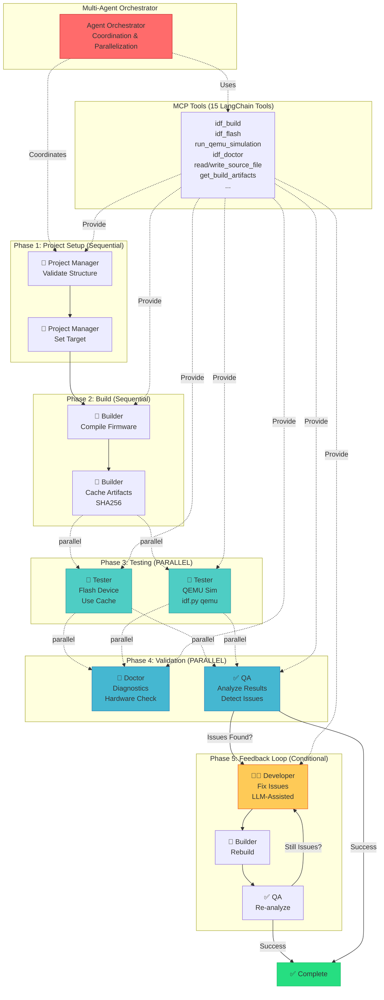

# Arquitectura Multi-Agente para ESP32 Development

## 🎭 Roles de Agentes

### 🎯 Project Manager
**Responsabilidades:**
- Validar estructura del proyecto
- Configurar target chip
- Coordinar workflow

**Tools:** `list_files`, `read_source_file`, `idf_set_target`

---

### 👨‍💻 Developer
**Responsabilidades:**
- Escribir/modificar código
- Corregir bugs reportados por QA
- Fixes LLM-asistidos

**Tools:** `read_source_file`, `write_source_file`, `list_files`

---

### 🔨 Builder
**Responsabilidades:**
- Compilar firmware
- Cachear artifacts con SHA256
- Reportes de tamaño

**Tools:** `idf_build`, `idf_clean`, `idf_size`, `get_build_artifacts`

**Performance:** Build cache ahorra 2-3 min por flash

---

### 🧪 Tester
**Responsabilidades:**
- Flash a hardware (**PARALLEL**)
- QEMU simulation (**PARALLEL**)
- Capturar outputs

**Tools:** `idf_flash`, `run_qemu_simulation`, `qemu_get_output`, `stop_qemu_simulation`, `qemu_simulation_status`

**Performance:** Flash + QEMU simultáneamente (~30s cada uno)

---

### 🏥 Doctor
**Responsabilidades:**
- Diagnóstico ESP-IDF
- Validar hardware
- Inspeccionar QEMU state

**Tools:** `idf_doctor`, `qemu_inspect_state`

---

### ✅ QA
**Responsabilidades:**
- Analizar resultados de tests
- Detectar fallos
- Reportar issues a Developer
- Validar fixes

**Tools:** `qemu_get_output`, `read_source_file`, `idf_size`

**Feedback Loop:** QA → Developer → Builder → QA (max 3 iterations)

---

## ⚡ Puntos de Paralelización

### Phase 3: Testing
```
Build Complete
    ├─> [PARALLEL] Flash to Hardware
    └─> [PARALLEL] QEMU Simulation
```
**Benefit:** Ejecuta flash + QEMU simultáneamente

### Phase 4: Validation
```
Tests Complete
    ├─> [PARALLEL] Doctor Diagnostics
    └─> [PARALLEL] QA Analysis
```
**Benefit:** Análisis independientes simultáneos

---

## 🔄 Feedback Loop (QA → Developer)

```
QA Detects Issues
    ↓
Developer Analyzes & Fixes
    ↓
Builder Recompiles
    ↓
QA Re-analyzes
    ↓
Success? → Complete
Failed? → Iterate (max 3x)
```

**Trigger:** QA detecta:
- Expected output missing
- Runtime errors
- Memory issues
- Unexpected behavior

**Process:**
1. QA genera reporte detallado
2. Developer recibe contexto
3. Fix automático o LLM-asistido
4. Rebuild automático
5. Re-test automático
6. Repeat hasta success o max iterations

---

## 📊 Performance Metrics

### Build Cache
- **First build:** ~120-180s
- **Cached flash:** ~30s
- **Savings:** 2-3 min per flash

### Parallel Execution
- **Sequential:** 80s total
- **Parallel:** 40s total
- **Savings:** 50% reduction

### QA Feedback Loop
- **Manual process:** 10+ min
- **Automated loop:** 5 min
- **Savings:** 5+ min + developer time

---

## 🚀 Workflow Example

```
1. Import Project from GitHub
   └─> [PM] Validate structure ✅

2. Set Target (esp32c6)
   └─> [PM] Configure target ✅

3. Build Firmware
   └─> [Builder] Compile + cache ✅
   └─> Artifacts: bootloader.bin, app.bin (SHA256: abc123...)

4. Testing (PARALLEL)
   ├─> [Tester] Flash to /dev/cu.usbmodem21101 ✅ (30s)
   └─> [Tester] QEMU simulation ✅ (30s)
       └─> Console: "Hello World! Counter: 0, 1, 2..."

5. Validation (PARALLEL)
   ├─> [Doctor] ESP-IDF check ✅ (10s)
   └─> [QA] Analyze outputs ✅ (10s)
       └─> All checks passed ✅

6. Result: SUCCESS ✅
   Total time: ~90s (vs ~150s sequential)
```

---

## 🔮 Future Enhancements

- Multi-device testing (flash a múltiples boards simultáneamente)
- Security scans (CVE checks, static analysis)
- Performance profiling
- Code coverage con QEMU
- Web UI para monitoring
- CI/CD integration (GitHub Actions, GitLab CI)
